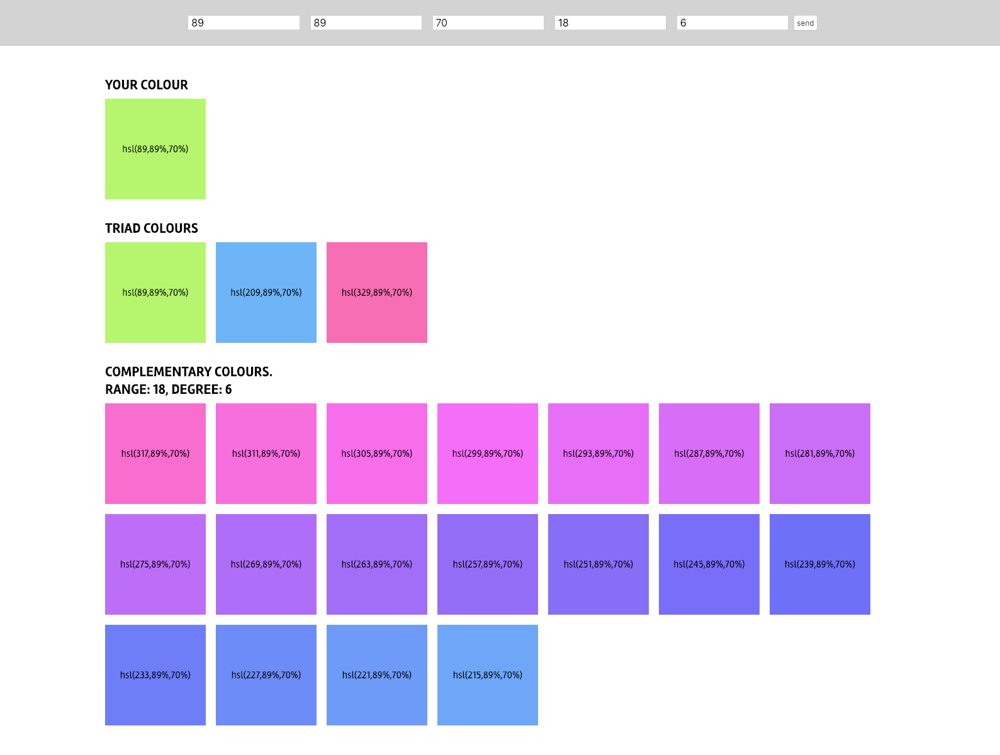

#ColorPalette

Script che genera diversi tipi di palette a partire da un colore di base

V1.1

##Funzionalità

###Crea colore hsl: 
Funzione hsl(degree, saturation, brightness) 
Argomenti - gradi (1-360), saturazione (1-100), luminosità (1-100) 

###Crea palette Triadica: 
Funzione getTriad(baseColor) 
Argomenti - colore di base 

###Crea palette di colori complementari: 
Funzione getComplementar(baseColor, numColor, step) 
Argomenti - colore di base, numero di colori desiderati, step in gradi tra un colore e l'altro 
Gradi massimi consentiti numColor*step 140 

###ToDo color schemes 
Analogous, Split-Complementary, Tetradic, Square, Monochrome 

