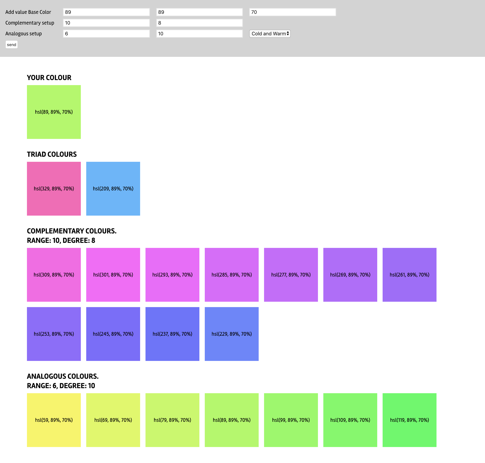

# ColorPalette

Script che genera diversi tipi di palette a partire da un colore di base

V1.3

## Funzionalità

### Crea colore Hsl:<br/>
```
var baseColor = new Hsl(degree, saturation, brightness)
```

#####Argomenti: <br/>
Gradi (1-360)<br/>
Saturazione (1-100)<br/> 
Luminosità (1-100)<br/>

#####Ritorna:
```
baseColor.getDegree() -> number
baseColor.getSaturation() -> number
baseColor.getBrightness() -> number
baseColor.printHsl() -> string hsl(degre, saturation% , brightness%)

```

### Crea palette SetColorPalette:<br/>
```
var palette = new SetColorPalette(baseColor)
```
#####Argomenti: <br/>
Colore di base

#####Ritorna:
```
palette.basecolor -> obj Hsl()
```
### Crea palette Triadica:<br/>
```
palette.triad()
```
#####Ritorna:
```
Array [obj Hsl(), obj Hsl(), ...]
```


### Crea palette di colori complementari:<br/>
```
palette.complementar(numColor, stepDegree)
```
#####Argomenti:<br/>
Numero di colori desiderati - numero pari <br/>
Step in gradi tra un colore e l'altro<br/>
Gradi massimi consentiti numColor*step = 140<br/>
#####Ritorna:
```
Array [obj Hsl(), obj Hsl(), ...]
```

### Crea palette di colori analoghi:<br/>
```
palette.analogous(typeScheme, numColor, stepDegree)
```
#####Argomenti:<br/>
Tipo di schema: 'allArch', 'cold', 'warm'<br/> 
Numero di colori desiderati - numero pari<br/>
Step in gradi tra un colore e l'altro<br/>
Gradi massimi consentiti numColor*step = 60<br/>
#####Ritorna:
```
Array [obj Hsl(), obj Hsl(), ...]
```

### ToDo color schemes<br/>
Split-Complementary, Tetradic, Square, Monochrome, Random Colors whith dominant color<br/>


