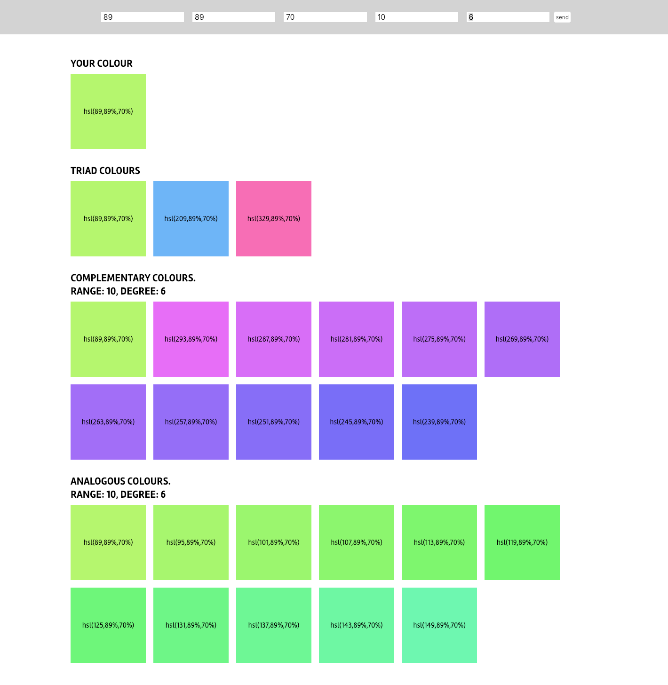

# ColorPalette

Script che genera diversi tipi di palette a partire da un colore di base

V1.2

## Funzionalità

### Crea colore hsl:<br/>
```
hsl(degree, saturation, brightness)
```

Argomenti - gradi (1-360), saturazione (1-100), luminosità (1-100)<br/>

### Crea palette Triadica:<br/>

```
getTriad(baseColor)
```
Argomenti - colore di base<br/>

### Crea palette di colori complementari:<br/>
```
getComplementar(baseColor, numColor, step)
```
Argomenti - colore di base, numero di colori desiderati, step in gradi tra un colore e l'altro<br/>
Gradi massimi consentiti numColor*step = 140<br/>

### Crea palette di colori analoghi:<br/>
```
getAnalogous(baseColor, numColor, step)
```
Argomenti - colore di base, numero di colori desiderati, step in gradi tra un colore e l'altro<br/>
Gradi massimi consentiti numColor*step = 60<br/>


### ToDo color schemes<br/>
Split-Complementary, Tetradic, Square, Monochrome<br/>


